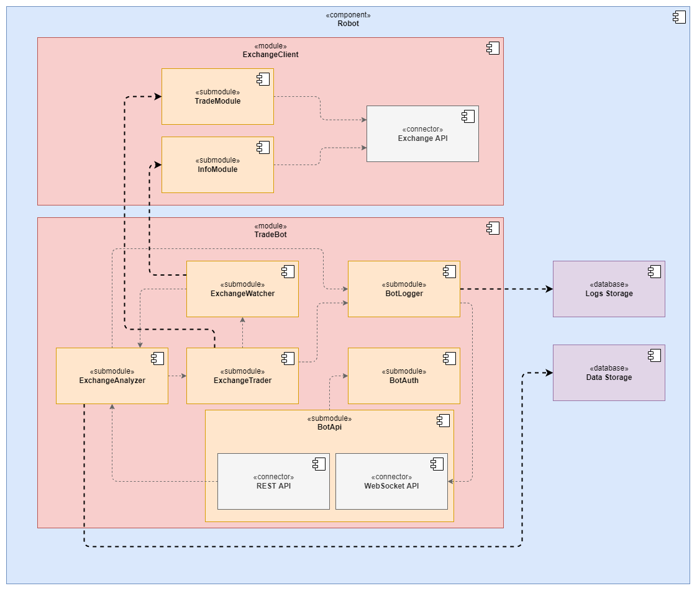

# Architecture

`TradeBot` is the server side software for processing exchange data and automatically planning orders. 

You can find TradeBot repository here: https://github.com/badlabs/trade-bot--tinkoff.

## Database

`TradeBot` maps all info parsed from exchange to its own data types and saves it into local SQLite database. This database is created with [Prisma ORM](https://www.prisma.io/).

Schema of local storage:

